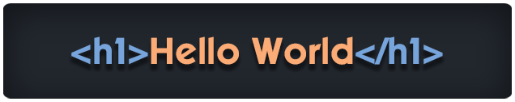

  

# 🏄‍♂️ Jleo

**`Full-stack and Game developer`**

## About me
Приветствую вас на моей страничке. Я fullstack и game разработчик, любящий создавать интересные приложения и игровые миры
> Welcome to my page. I am a fullstack and game developer who loves to create interesting applications and game worlds

---

## 🧰 Languages and Tools

 
 
 
 
 

#

## 📊 Stats

